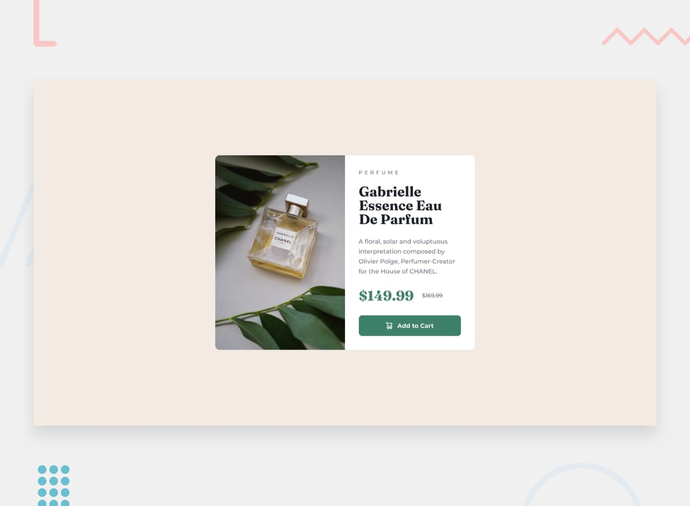

# Frontend Mentor - Product preview card component solution

This is my solution to the [Product preview card component challenge on Frontend Mentor](https://www.frontendmentor.io/challenges/product-preview-card-component-GO7UmttRfa).

## Overview

### The challenge

The goal was to build a responsive product preview card as close as possible to the provided design.

Users should be able to:

* View the optimal layout depending on their device's screen size
* See hover and focus states for interactive elements

### Screenshot

### Links

* Solution URL: https://github.com/sravankumar-0710/frontend-mentor-product-preview-card
* Live Site URL: Add your deployed site URL here

## My process

### Built with

* Semantic HTML5 markup
* CSS
* Flexbox
* Responsive design
* CSS media queries
* Relative units using `rem`
* `<picture>` and responsive images
* Google Fonts (Montserrat and Fraunces)

### What I learned

This project helped me practice building a responsive layout from a static design.

Some of the main concepts I worked with were:

* Using Flexbox to create the two-column desktop layout
* Changing the layout to a single column on smaller screens
* Using the `<picture>` element to serve different images for desktop and mobile
* Using `rem` and percentage-based sizing to make the component responsive
* Working with CSS typography, spacing, colors, and hover states
* Centering a component vertically and horizontally using Flexbox

One important part was learning how to make the desktop card responsive without relying entirely on fixed pixel dimensions.

### Continued development

In future projects, I want to continue improving:

* Responsive CSS
* Accessibility and semantic HTML
* CSS layout techniques
* Typography and spacing
* Writing cleaner and more maintainable CSS
* Building more complex responsive interfaces

### Useful resources

* [Frontend Mentor](https://www.frontendmentor.io/) - The challenge and design provided the main practice for this project.
* [MDN Web Docs](https://developer.mozilla.org/en-US/docs/Web/CSS) - Used as a reference for HTML and CSS concepts.
* [CSS-Tricks](https://css-tricks.com/) - Useful reference for CSS layout and Flexbox concepts.

## Author

* GitHub - [@sravankumar-0710](https://github.com/sravankumar-0710)
* Frontend Mentor - [@sravankumar-0710](https://www.frontendmentor.io/profile/sravankumar-0710)

## Acknowledgments

Thanks to [Frontend Mentor](https://www.frontendmentor.io/) for providing the challenge and design resources.
